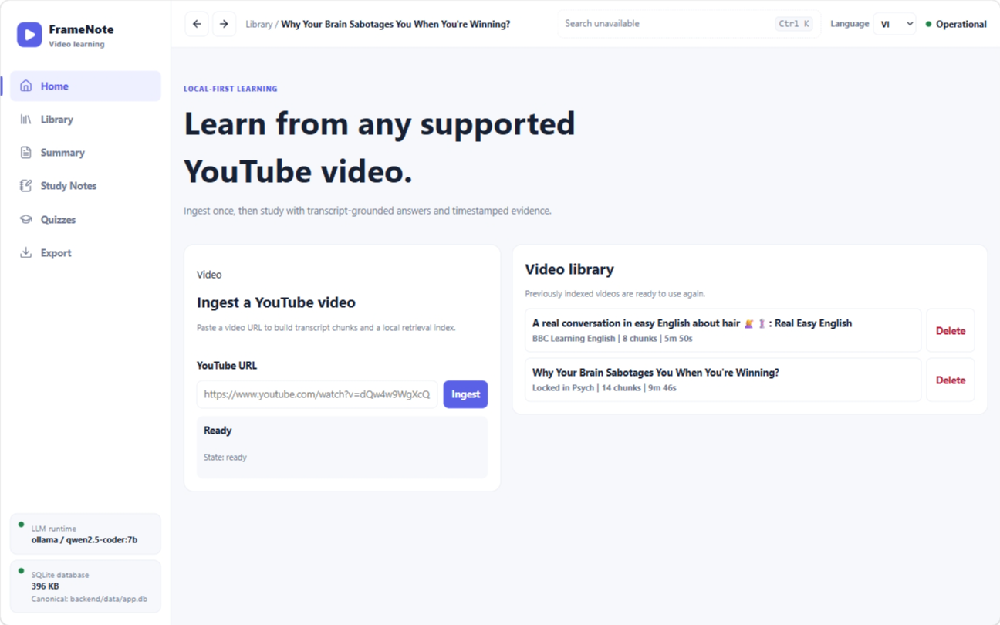
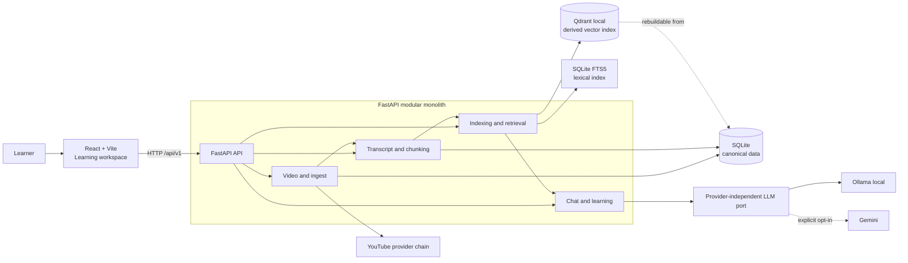
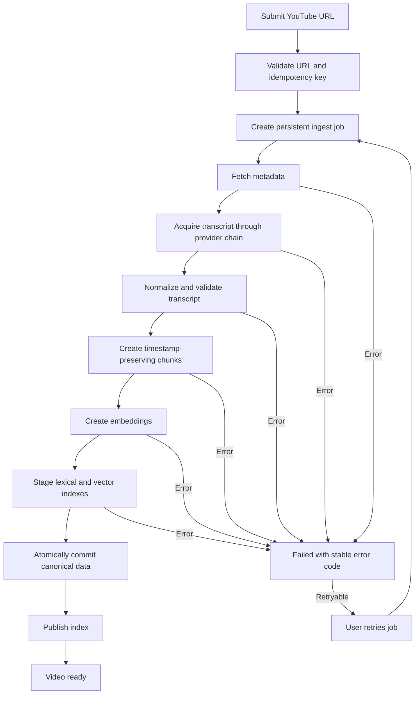
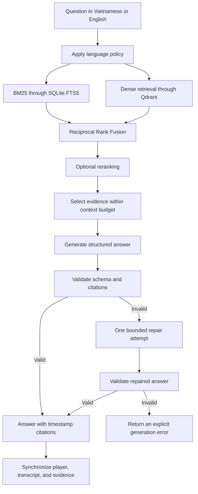
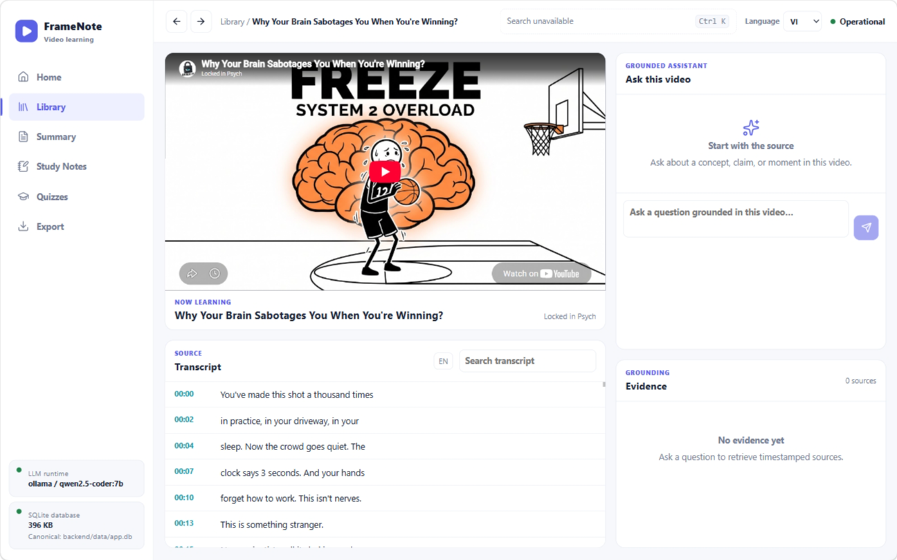

# YouTube Video Q&A Assistant

A local-first application that turns YouTube videos into searchable, evidence-grounded learning workspaces. Learners can read timestamped transcripts, ask questions, inspect supporting evidence, create summaries, study notes and quizzes, and export learning artifacts to Markdown.

The product treats Vietnamese and English as first-class languages, runs locally without requiring a paid API, and preserves timestamp provenance through ingest, retrieval, and citation.

<p align="center">
  
</p>

## Project status

The main Local V1 flows are available:

- Persistent YouTube ingest jobs with real status, retry, cancellation, and restart recovery.
- Canonical timestamped transcripts with acquisition and normalization provenance.
- BM25, dense retrieval, Reciprocal Rank Fusion, and optional reranking.
- Grounded chat with validated citations synchronized across the player, transcript, and evidence.
- Summary, study-note, quiz, and Markdown export workflows.
- A responsive React learning workspace.
- SQLite canonical storage with a rebuildable local Qdrant vector index.
- Ollama-first local generation with explicit Gemini opt-in.

See the [Capability Matrix](docs/09-execution/capability-matrix.md) for the verified status of each capability. Production deployment is not yet a supported or verified target.

## Architecture

The application is a **modular monolith**: one React frontend and one FastAPI backend. Backend modules are separated by domain, application, and infrastructure boundaries rather than network services.



Key rules:

- SQLite is the canonical store; Qdrant contains derived data that can be rebuilt.
- API handlers call application use cases; business logic does not depend on FastAPI or provider SDKs.
- Ollama, Gemini, Qdrant, and YouTube integrations remain isolated in adapters.
- Ingest and retrieval remain available when the configured LLM is unavailable.
- A paid provider is never used as a silent fallback.

See the [Target Architecture](docs/01-architecture/target-architecture.md) for module boundaries and dependency rules.

## Video ingest flow

The frontend uses persistent ingest jobs. A video becomes `ready` only after every required stage has completed.



The UI derives progress and state from the backend; it does not fabricate percentages or completion states.

## Grounded question-answering flow



When the available evidence is insufficient, the application reports that limitation instead of fabricating an answer.

### Video demo

Click the preview to watch the ingest and grounded question-answering workflow:

[](https://youtu.be/7W6mfxgqifI)

<p align="center">
  <a href="https://youtu.be/7W6mfxgqifI"><strong>▶ Watch the full demo on YouTube</strong></a>
</p>

## Requirements

- Windows 11 or current Ubuntu LTS. macOS support is best effort.
- Python 3.12.
- `uv` for the locked Python environment.
- Node.js 22 LTS and npm.
- Ollama when using local generation or an embedding model served by Ollama.

The authoritative versions and dependencies are defined in `.python-version`, `.nvmrc`, `backend/pyproject.toml`, `backend/uv.lock`, and `frontend/package-lock.json`.

## Quick start

Run these commands from the repository root.

### 1. Install dependencies

```powershell
python -m pip install --user uv
python -m uv python install 3.12
python -m uv sync --project backend --locked
npm.cmd --prefix frontend ci
```

`backend/requirements.txt` is a deprecated compatibility snapshot. Manage backend dependencies through `pyproject.toml` and `uv.lock`.

### 2. Initialize the database

```powershell
python -m uv run --project backend alembic -c backend/alembic.ini upgrade head
```

The default local database is created at `backend/data/app.db`.

### 3. Prepare local models when needed

```powershell
ollama pull qwen3:4b
ollama pull qwen3-embedding:0.6b
```

Generation and embedding models are explicit local assets. Tests and ingest never download them implicitly. See [Local Development](docs/07-operations/local-development.md) for the `test`, `light`, and `standard` profiles and optional language-model assets.

### 4. Start the application

Backend terminal:

```powershell
python -m uv run --project backend uvicorn app.main:app --app-dir backend --reload
```

Frontend terminal:

```powershell
npm.cmd --prefix frontend run dev
```

After startup:

- Frontend: <http://localhost:5173>
- Backend health: <http://127.0.0.1:8000/api/v1/health>
- OpenAPI UI: <http://127.0.0.1:8000/docs>

## Usage

1. Open the frontend and submit a YouTube URL from Home or Library.
2. Follow the backend-reported ingest stages; retry or cancel when available.
3. Open a `ready` video from the Library.
4. Select a transcript timestamp to seek the player.
5. Ask a question in Vietnamese or English.
6. Select a citation or evidence card to synchronize the player and transcript.
7. Use Summary, Study Notes, Quizzes, or Export as needed.

<p align="center">
  
</p>

## Repository structure

```text
.
├── backend/
│   ├── app/
│   │   ├── api/              # HTTP routes and API contracts
│   │   ├── application/      # Use cases and provider ports
│   │   ├── domain/           # Entities and business invariants
│   │   ├── infrastructure/   # SQLite, Qdrant, YouTube, Ollama, Gemini
│   │   └── core/             # Configuration, errors, and runtime setup
│   ├── alembic/              # Database migrations
│   ├── evaluation/           # Retrieval evaluation
│   ├── tests/
│   ├── pyproject.toml
│   └── uv.lock
├── frontend/
│   ├── src/
│   │   ├── app/              # Application shell and routing
│   │   ├── page/             # Page-level route composition
│   │   ├── features/         # Ingest, transcript, chat, evidence, learning
│   │   └── shared/           # API, UI primitives, and utilities
│   └── package.json
├── docs/                     # Specifications, ADRs, and executable tasks
├── scripts/                  # Quality gate and OpenAPI generation
└── README.md
```

Some legacy modules remain during incremental migration. Use the [Capability Matrix](docs/09-execution/capability-matrix.md) to distinguish target architecture from verified implementation.

## Quality checks

Run the complete local quality gate from the repository root:

```powershell
./scripts/verify.ps1
```

On Linux or macOS:

```bash
python3 scripts/verify.py
```

The gate covers lockfiles, Ruff, Pyright, backend tests, OpenAPI drift, frontend lint, frontend tests, and the production build. Live YouTube/Ollama smoke tests and model downloads are intentionally excluded from the deterministic gate.

## Local data

All runtime data is rooted under `backend/data/` and must not be committed:

- SQLite stores canonical data and persistent ingest jobs.
- SQLite FTS5 supports lexical retrieval.
- Qdrant local stores the derived dense index and can be rebuilt from SQLite.
- Legacy JSON and Chroma data are migration or compatibility sources, not the target architecture.

Do not delete the database or index manually without first identifying which data must be preserved. Use migrations and the application's lifecycle APIs.

## Current limitations

- Production deployment, multi-user isolation, authentication, and quotas are not yet supported.
- There is no local ASR fallback for videos without a suitable transcript.
- Ingest may fail when YouTube or a transcript provider blocks access.
- Generation depends on installed local models and the machine's RAM or VRAM.
- Qdrant currently runs in local persistent mode; server mode belongs to a future production phase.

## Documentation

- [Documentation Index](docs/README.md)
- [Product Vision](docs/00-product/product-vision.md)
- [Interface Specification](docs/00-product/interface-specification.md)
- [Target Architecture](docs/01-architecture/target-architecture.md)
- [Local Development](docs/07-operations/local-development.md)
- [Capability Matrix](docs/09-execution/capability-matrix.md)
- [Implementation Roadmap](docs/09-execution/roadmap.md)

When documentation conflicts, accepted ADRs and normative specifications take precedence over explanatory README content. FastAPI-generated OpenAPI is authoritative for the currently implemented HTTP schema.
